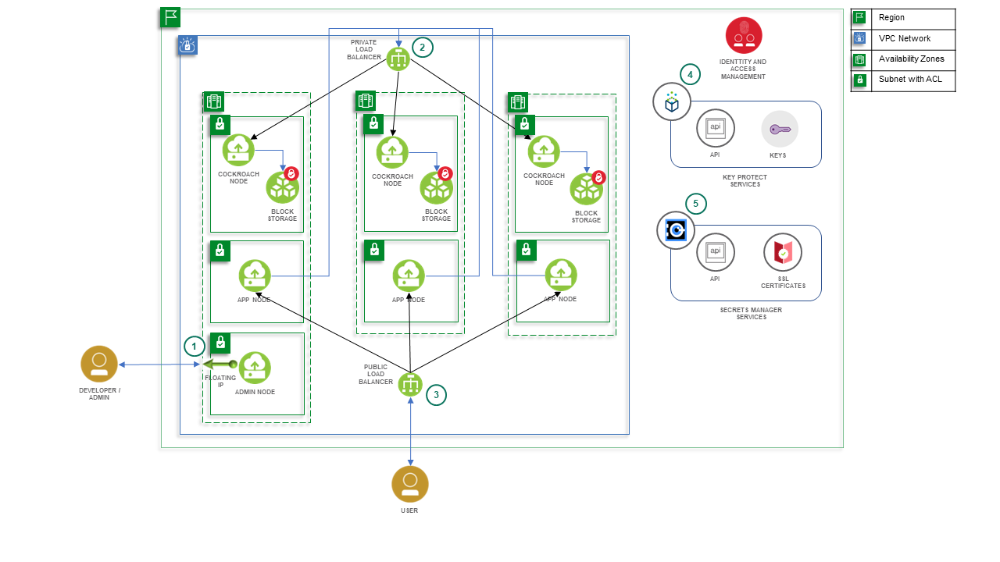
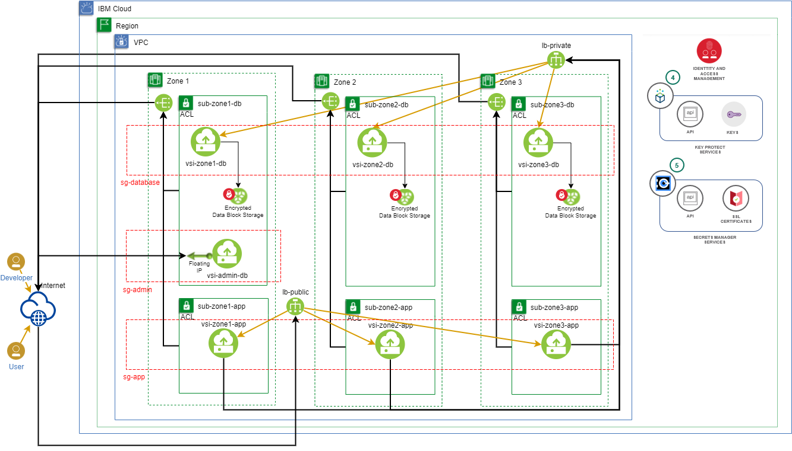

## Deploying CockroachDB in a Multi-Zoned Virtual Private Cloud with Encrypted Block Storage

Use this Terraform template to provision a Virtual Private Cloud (VPC), install/configure a database and deploy a small application in IBM Cloud by using [IBM Cloud Schematics](https://cloud.ibm.com/docs/schematics?topic=schematics-about-schematics) or Terraform.


The IBM Cloud database service is automatically configured during the installation and security groups are created so that your virtual server instance can connect to the database port. To ensure that your database instance can be accessed by the virtual server instance only, whitelist rules are added to your database instance.



# Costs

When you apply this template, you are charged for the resources that you configure.

You can remove all resources created by running a Terraform destroy command described below. Make sure that you back up any data that you wish to keep before you start the deletion process.

You can remove all resources created by running a terraform destroy command [described below](#delete-all-resources). Make sure that you back up any data that you wish to keep before you start the deletion process.

# Requirements

-  If you are running on a Windows operating system [install Git](https://git-scm.com/), the script is written in Bash and Git when installed on Windows will also include Git Bash that you can use to run the script.

- [Install IBM Cloud CLI](/docs/cli?topic=cloud-cli-install-ibmcloud-cli) and required plugins:
  - key-protect (0.3.8 or higher)

- [Install jq](https://stedolan.github.io/jq/).

- [Install Terraform](https://www.terraform.io/downloads.html), note version [0.11.14](https://releases.hashicorp.com/terraform/0.11.14/) or lower is required by the IBM Cloud provider.

- [Install the IBM Cloud provider plugin for Terraform](https://github.com/IBM-Cloud/terraform-provider-ibm#using-the-provider)

> The script will validate the version of Terraform and the IBM Cloud provider plugin.

## Getting started

- Clone this repo

- From a bash terminal window change to the `vpc-cockroachdb-mzr` directory.

### Build the environment in the IBM Cloud using a prepared Terraform script

- Copy the config-template directory to another directory called config.
  ```sh
    cp -a config-template config
  ```

- Modify config/database-app-mzr.sh file to match your desired settings and place in a directory of your choice, the following properties must be set:

|  Name               | Description                         | Default Value |
| -------------------| ------------------------------------|---------------- |
| TF_VAR_ibmcloud_api_key | An API key is a unique code that is passed to an API to identify the application or user that is calling it. To prevent malicious use of an API, you can use API keys to track and control how that API is used. For more information about API keys, see [Understanding API keys](https://cloud.ibm.com/docs/iam?topic=iam-manapikey). |
| TF_VAR_resources_prefix | a value that will be used when naming resources it is added to the value of the name properties with a `-`, i.e. cockroach-vsi-database-1 | cockroachdb |
| TF_VAR_vpc_region        | name of the region to create the resources, currently it can be a choice between `au-syd`, `us-south`, `eu-de` , `eu-gb` or `jp-tok`. See [here](https://cloud.ibm.com/docs/vpc-on-classic-vsi?topic=vpc-on-classic-vsi-faqs#what-regions-are-available-) for more information. | us-south |
| TF_VAR_resource_group | name of your resource group you will be creating the resources under (must exist prior to usage) | default |
| TF_VAR_vpc_ssh_keys | Existing SSH key name(s) for in region access to VSIs after creation, you must create at least one if you do not already have any. More information on creating SSH keys is available in the [product documentation](https://cloud.ibm.com/docs/vpc-on-classic-vsi?topic=vpc-on-classic-vsi-ssh-keys). |
| TF_VAR_ssh_private_key_file | Location of your SSH private key | ~/.ssh/id_rsa |
| TF_VAR_ssh_private_key_format | Values can be file: requires for `ssh_private_key_file` to be set , content: requires for `ssh_private_key_content` to be set or build: will create an SSH key for use during the build. | build |

- Initialize the Terraform providers and modules. Run:
```sh
terraform init
```

- Execute the following command to add the values to your environment:
```sh
source config/database-app-mzr.sh
```

- Execute terraform plan by specifying location of variable files, state and plan file:
```sh
terraform plan -state=config/database-app-mzr.tfstate -out=config/database-app-mzr.plan
```

- Apply terraform plan by specifying location of plan file:
```sh
terraform apply -state-out=config/database-app-mzr.tfstate config/database-app-mzr.plan
```

- The scripts will run to completion and you will receive an output similar to the one below, note that the number of resources added in the screenshot below may be different from what you get as it is based on revisions made to the template.  If the script were to get interrupted for any reason, you can address the error, run a plan and apply again.


### Test the cluster (taken from the CockroachDB documentation)

1.	SSH into the admin instance.

    admin instance
    ```
    ssh -F vpc-cockroachdb-mzr/ssh-init/ssh.config root@<admin_instance_ip>
    ```

2.  Using the internal IP address of node 1, issue the following command:
    ```
    cockroach sql --certs-dir=/certs --host=<IP address node>
    ```

3.  Run the following CockroachDB SQL statements:

    ```sql
    CREATE USER IF NOT EXISTS maxroach;
    ```

    ```sql
    CREATE DATABASE bank;
    ```

    ```sql
    GRANT ALL ON DATABASE bank TO maxroach;
    ```

    ```sql
    CREATE TABLE bank.accounts (id UUID PRIMARY KEY DEFAULT gen_random_uuid(), transactiontime TIMESTAMPTZ DEFAULT current_timestamp(),  balance DECIMAL);
    ```

    ```sql
    INSERT INTO bank.accounts (balance) VALUES (1000.50);
    ```

    ```sql
    SELECT * FROM bank.accounts;
    ```

    ```
    +----+---------+
    | id | balance |
    +----+---------+
    |  e915b462-f415-4b67-bd0d-fd22a68a62a5 |  1000.5 |
    +----+---------+
    (1 row)
    ```

4.  Exit the SQL shell on node 1:

    ```sql
    \q
    ```

5.  Then connect the SQL shell to node 2, this time specifying the node's non-default port:

    ```shell
    $ cockroach sql --certs-dir=/certs --host=<IP address node>
    ```

6. Now run the same `SELECT` query:

    ```sql
    SELECT * FROM bank.accounts;
    ```

    ```
    +----+---------+
    | id | balance |
    +----+---------+
    |  e915b462-f415-4b67-bd0d-fd22a68a62a5 |  1000.5 |
    +----+---------+
    (1 row)
    ```

    ```sql
    INSERT INTO bank.accounts (balance) VALUES (100.75);
    ```

7. Exit the SQL shell on node 2:

    ```sql
    \q
    ```

8. Repeat the same steps used for node 2 above for node 3, but change the insert to the one below:

    ```sql
    INSERT INTO bank.accounts (balance) VALUES (50.00);
    ```

## Try a small application

1.  Open your browser and navigate the to the public load balancer address: http://<public_lb>/api/bank.

2.	Copy and paste the following queries:

```graphql
query read {
  read_database{
    id
    balance
    transactiontime
  }
}

mutation add {
  add(balance:220){
    status
  }
}
```

4.	Execute a few read(s) and an add(s) while changing the value for the balance to validate entries are added.

    

## Monitor the cluster

On accessing the Admin UI, your browser will consider the CockroachDB-created certificate invalid, so you’ll need to click through a warning message to get to the UI. For secure clusters, you can avoid getting the warning message by using a certificate issued by a public CA.

For each user who should have access to the Admin UI for a secure cluster, create a user with a password.

1. Configure a web proxy to admin server and SSH into the admin instance,
    ```
    ssh -F vpc-cockroachdb-mzr/ssh-init/ssh.config -L 8080:<address of any node>:8080 root@<admin_instance_ip>
    ```

2.  Using the internal IP address of node 1, issue the following command:
    ```
    cockroach sql --certs-dir=/certs --host=<IP address node>
    ```

3.  Run the following CockroachDB SQL statements:

    ```sql
    CREATE USER IF NOT EXISTS uiadmin WITH PASSWORD '<a password>';
    ```

    ```sql
    GRANT admin TO uiadmin;
    ```

4. Access the Admin UI for your cluster by pointing a browser to `http://localhost:8080`.

    

    Then click **Metrics** on the left-hand navigation bar.

    As mentioned earlier, CockroachDB automatically replicates your data behind-the-scenes. To verify that data written in the previous step was replicated successfully, scroll down to the **Replicas per Node** graph and hover over the line:

    

    The replica count on each node is identical, indicating that all data in the cluster was replicated 3 times (the default).

## Delete all resources

Running the following script will delete all resources listed inside of the config/database-app-mzr.tfvars, recall it was created earlier during the build process .  Please note it will also delete the Key Protect store and stored encryption keys, as well as the Certificate Manager and all the certs used by the cockroach instances.

```
terraform destroy -state=config/database-app-mzr.tfstate
```

## Reference our tutorials

- You can also build the resources using the IBM Cloud UI or CLI. Reference the following tutorials for examples/steps to manually build the resources you would need:

    - [Private and public subnets in a Virtual Private Cloud](https://cloud.ibm.com/docs/tutorials?topic=solution-tutorials-vpc-public-app-private-backend)

    - [Deploy isolated workloads across multiple locations and zones](https://cloud.ibm.com/docs/tutorials?topic=solution-tutorials-vpc-multi-region)

    - [Creating block storage volumes in IBM Cloud console](https://cloud.ibm.com/docs/infrastructure/block-storage-is?topic=block-storage-is-creating-block-storage&topicid=block-storage-is-block-storage-getting-started)

    - [Securely access remote instances with a bastion host](https://cloud.ibm.com/docs/tutorials?topic=solution-tutorials-vpc-secure-management-bastion-server)

    - [Deploy CockroachDB](https://www.cockroachlabs.com/docs/stable/deploy-cockroachdb-on-premises-insecure.html#systemd) leveraging the documentation from CockroachDB for on-premises deployment. One difference is we will use the load balancer service provided in the IBM Cloud VPC rather than installing the HA Proxy.

## Detail diagram of deployment via config template



>**Note 1:** Load Balancers (LBaaS) and Public Gateways (PGW) are available across region with redundancy and auto-scale based on load and are IBM Cloud managed.

>**Note 2:** PGW are for outbound Internet access only, no inbound allowed unless it is a response to outbound request.

>**Note 3:** The data volumes are not shared as the database engine will handle data replication between the nodes. If the application requires it they can be shared.

>**Note 4:** The load balancers to the database instances have an internal only outbound and will not accept any connections outside of the VPC.

>**Note 5:** The load balancer to the application instances are public and have an external outbound, customer can also use their own address if desired.
