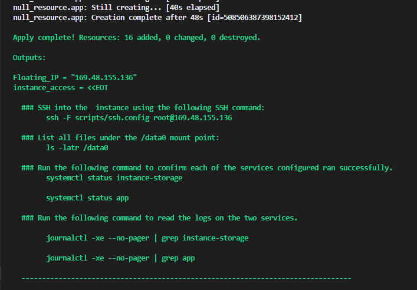

## Automate the configuration of Instance Storage on a VSI

Use this Terraform template to provision a Virtual Private Cloud (VPC), install/configure a instance storage and deploy a small application in IBM Cloud by using [IBM Cloud Schematics](https://cloud.ibm.com/docs/schematics?topic=schematics-about-schematics) or Terraform.


# Costs

When you apply this template, you are charged for the resources that are configured.

You can remove all resources created by running a terraform destroy command [described below](#delete-all-resources). Make sure that you back up any data that you wish to keep before you start the deletion process.

# Requirements

- [Install Terraform](https://www.terraform.io/downloads.html), note version 0.12.x or higher is required by the IBM Cloud provider.

- The template when run will automatically [install the IBM Cloud provider plugin for Terraform](https://github.com/IBM-Cloud/terraform-provider-ibm#using-the-provider) for you.

> The script will validate the version of Terraform and the IBM Cloud provider plugin.

## Getting started

- Clone this repo

- From a bash terminal window change to the `vpc-instance-storage` directory.

### Build the environment in the IBM Cloud using a prepared Terraform script

This template will create a 1 x VPC, 1 x Subnet, 1 x Public Gateway, 1 x Virtual Server Instance and 1 Floating IP. 

- Copy the config-template directory to another directory called config.
  ```sh
    cp -a config-template config
  ```

- Modify config/env-config.sh file to match your desired settings and place in a directory of your choice, the following properties must be set:

|  Name               | Description                         | Default Value |
| -------------------| ------------------------------------|---------------- |
| TF_VAR_ibmcloud_api_key | An API key is a unique code that is passed to an API to identify the application or user that is calling it. To prevent malicious use of an API, you can use API keys to track and control how that API is used. For more information about API keys, see [Understanding API keys](https://cloud.ibm.com/docs/iam?topic=iam-manapikey). |
| TF_VAR_resources_prefix | a value that will be used when naming resources it is added to the value of the name properties with a `-` | is |
| TF_VAR_vpc_region        | name of the region to create the resources, See [here](https://cloud.ibm.com/docs/vpc?topic=vpc-creating-a-vpc-in-a-different-region) for more information. | us-south |
| TF_VAR_resource_group | name of your resource group you will be creating the resources under (must exist prior to usage) | default |
| TF_VAR_vpc_ssh_keys | Existing SSH key name(s) for in region access to VSIs after creation, you must create at least one if you do not already have any. More information on creating SSH keys is available in the [product documentation](https://cloud.ibm.com/docs/vpc?topic=vpc-ssh-keys). |
| TF_VAR_ssh_private_key_file | Location of your SSH private key | ~/.ssh/id_rsa |
| TF_VAR_ssh_private_key_format | Values can be file: requires for `ssh_private_key_file` to be set , content: requires for `ssh_private_key_content` to be set or build: will create an SSH key for use during the build. | build |

- Initialize the Terraform providers and modules. Run:
```sh
terraform init
```

- Execute the following command to add the values to your environment:
```sh
source config/env-config.sh
```

- Apply Terraform:
```sh
terraform apply
```

- The scripts will run to completion and you will receive an output similar to the one below, note that the number of resources added in the screenshot below may be different from what you get as it is based on revisions made to the template.  If the script were to get interrupted for any reason, you can address the error, run `Terraform apply` again.



### Test the configuration

1.	SSH into the  instance.

    ```
    ssh -F scripts/ssh.config root@<instance_floating_ip>
    ```

2.  List all files under the */data0* mount point
    ```
    ls -latr /data0
    ```

3.  Run the following command to confirm each of the services configured ran successfully.
    ```
    systemctl status instance-storage
    ```

    ```
    systemctl status app
    ```

4.  Run the following command to read the logs on the two services.
    ```
    journalctl -xe --no-pager | grep instance-storage
    ```

    ```
    journalctl -xe --no-pager | grep app
    ```

5. Using the IBM Cloud Console, Stop the VSI, wait 1 minute and Start the VSI.

6. SSH into the  instance and repeat steps 2.  Notice that it takes a few seconds for 1) the mount point /data0 to become available and 2) for data to show under the data0.  You can use the commands in steps 3 and 4 to review how long it took for each service to start. 


## Delete all resources

Running the following script will delete all resources created earlier during the apply/build process.

```
terraform destroy
```

## Reference our tutorials

- You can also build the resources using the IBM Cloud UI or CLI. Reference the following tutorials for examples/steps to manually build the resources you would need:

    - [Securely access remote instances with a bastion host](https://cloud.ibm.com/docs/tutorials?topic=solution-tutorials-vpc-secure-management-bastion-server)
